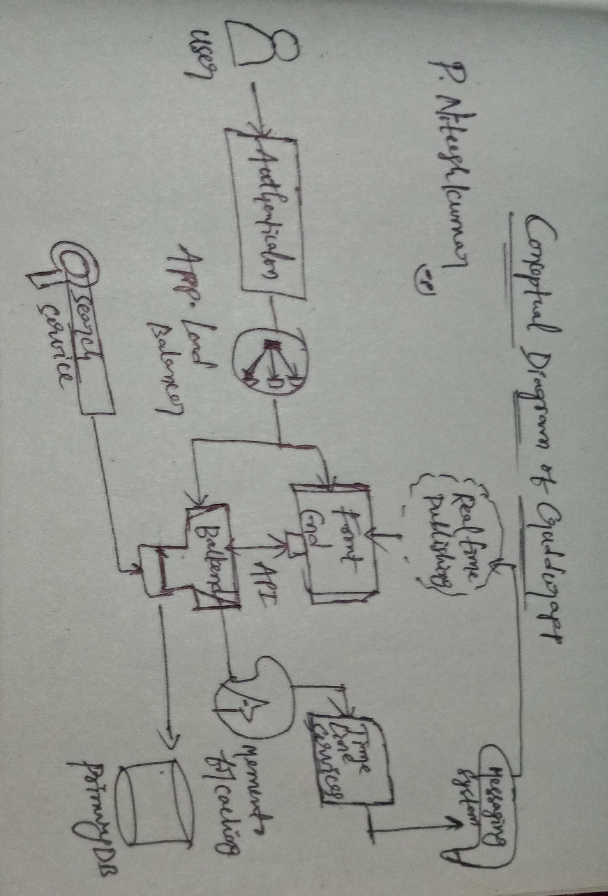
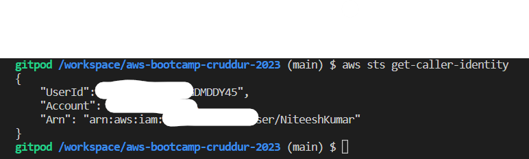
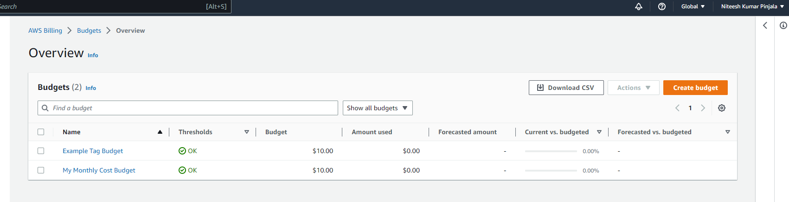
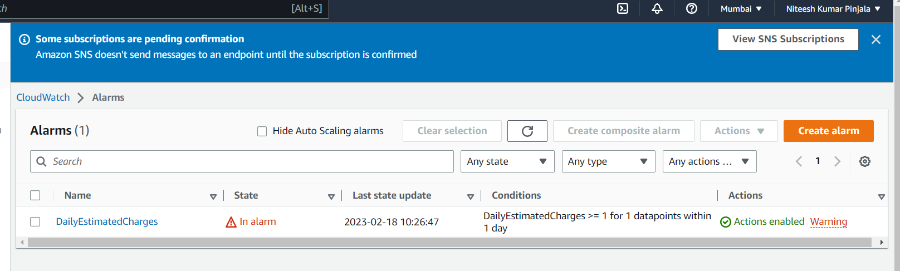

# Week 0 — Billing and Architecture

#### Cruddur Architecutural diagram

[Architecural Link](https://lucid.app/lucidchart/f1d3f719-bec8-4a69-a0bc-eae305a27051/edit?invitationId=inv_60fbd21d-eb63-4079-8697-69db4ee083b5)

#### Cruddur Napin Design



## Getting Started with AWS CLI

- We will be making use of Gitpod as part of AWS CLI installation.
- Open Gitpod through your Github repositoty and start executing the below commands.
-  [AWS CLI Reference Documentation](https://awscli.amazonaws.com/v2/documentation/api/latest/reference/index.html)

```
curl "https://awscli.amazonaws.com/awscli-exe-linux-x86_64.zip" -o "awscliv2.zip"
      unzip awscliv2.zip
      sudo ./aws/install
```
## Configure your aws account in Gitpod

- Make use of below commands, add your account details and run them in CLI.

```
export AWS_ACCESS_KEY_ID=""
export AWS_SECRET_ACCESS_KEY=""
export AWS_DEFAULT_REGION=""
```
#### As we don't want to configure our account every time we run a workspace, we better save the variable details in gitpod.

- Save above aws account details in gitpod environmental variables, run them in CLI.

```
gp env AWS_ACCESS_KEY_ID=""
gp env AWS_SECRET_ACCESS_KEY=""
gp env AWS_DEFAULT_REGION=""
```

- Check whether user existed in Gitpod AWS CLI

```
aws sts get-caller-identity
```

You should get something like this with details :).

```
{
    "UserId": "",
    "Account": "",
    "Arn": ""
}
```
#### Proof



## Creating a Budget through AWS CLI

[Budget CLI Reference documention](https://docs.aws.amazon.com/cli/latest/reference/budgets/create-budget.html#examples)

- Get your Account ID by running below command through CLI

```
aws sts get-caller-identity --query Account --output text
```
- Fill all the required details below and run the same in AWS CLI

```
aws budgets create-budget \
    --account-id $AWS_ACCOUNT_ID \
    --budget file://aws/json/budget.json \
    --notifications-with-subscribers file://aws/json/budget-notifications-with-subscribers.json
```
#### Proof


	
### Create SNS Topic for Billing

- We need a new SNS topic before we create an alarm.
- The SNS topic send out a delivery to us an alert when we get overbilled
- [aws sns create-topic](https://docs.aws.amazon.com/cli/latest/reference/sns/create-topic.html)

Create a SNS Topic by running below command through CLI

```
aws sns create-topic --name billing-alarm-cli
```
which will return a TopicARN

We'll create a subscription with the help of TopicARN and our Email

```
aws sns subscribe \
    --topic-arn=TopicARN \
    --protocol=email \
    --notification-endpoint=pinjalaniteesh@email.com
```

Check your email and confirm the subscription


### Create an Billing Alarm

- [aws cloudwatch put-metric-alarm](https://docs.aws.amazon.com/cli/latest/reference/cloudwatch/put-metric-alarm.html)
- [Create an Alarm via AWS CLI](https://aws.amazon.com/premiumsupport/knowledge-center/cloudwatch-estimatedcharges-alarm/)
- We need to update the configuration json script with the TopicARN we generated earlier
- We will be making use of Create an Alarm via AWS CLI link to create json file. 
- Change Alarm actions in alarm-config-json file to your own alarm by filling below details
```
rn:aws:sns:<REGION>:<ACCOUNT_ID>:<SNS_TOPIC_NAME>
```
- One's this is down now run below command to create alarm
```sh
aws cloudwatch put-metric-alarm --cli-input-json file://aws/json/alarm-config.json
```
#### Proof




