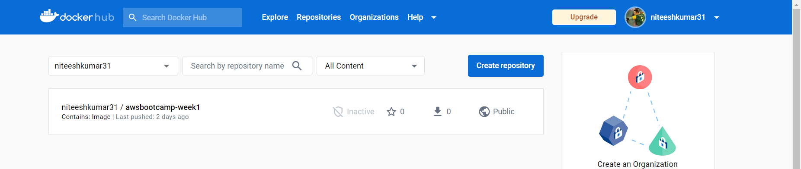
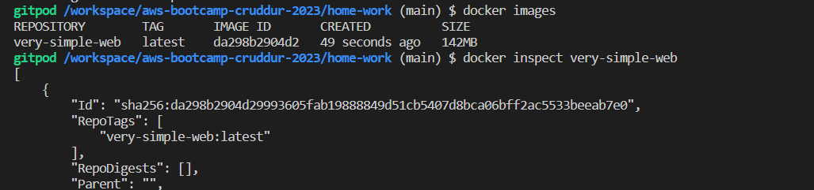
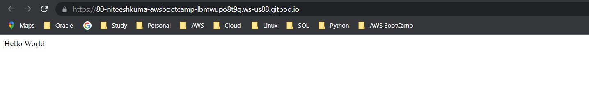
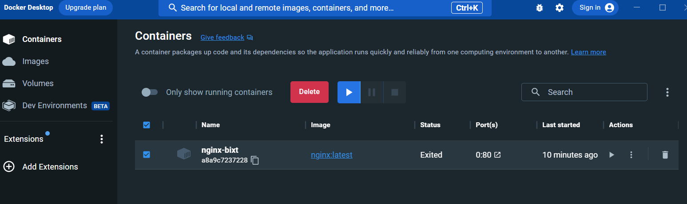
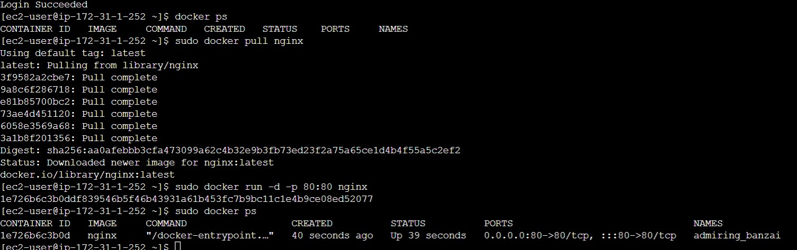

# Week 1 — App Containerization


## VSCode Docker Extension

Install Docker Extensions if you're not seeing it on you lefthand pane in Gitpod.

https://code.visualstudio.com/docs/containers/overview

## Containerize Backend

```sh
pip3 install -r requirements.txt
```
- To install Python flask in the backend

```
python3 -m flask run --host=0.0.0.0 --port=4567 
```
- Now, click on ports and open 4567, you should be getting 404 error, that's because we didn't configured Environmental Variables.
- Configure Environmental Variables and try installing flask.

```sh
export FRONTEND_URL="*"
export BACKEND_URL="*"
python3 -m flask run --host=0.0.0.0 --port=4567
cd ..
```

- make sure to unlock the port on the port tab
- open the link for 4567 in your browser
- append to the url to `/api/activities/home`
- you should get back some json in url


### Build Container

- Unset FRONTEND_URL and Unset BACKEND_URL
- Run docker build to create backend-flask container

```sh
docker build -t  backend-flask ./backend-flask
```

### Run Container

Run 
```sh
docker run --rm -p 4567:4567 -it backend-flask
FRONTEND_URL="*" BACKEND_URL="*" docker run --rm -p 4567:4567 -it backend-flask
export FRONTEND_URL="*"
export BACKEND_URL="*"
docker run --rm -p 4567:4567 -it -e FRONTEND_URL='*' -e BACKEND_URL='*' backend-flask
```

To Run in background
```sh
docker container run --rm -p 4567:4567 -d backend-flask
```

### Get Container Images or Running Container Ids

```
docker ps
docker images
```


### Send Curl to Test Server

```sh
curl -X GET http://localhost:4567/api/activities/home -H "Accept: application/json" -H "Content-Type: application/json"
```

### Check Container Logs

```sh
docker logs CONTAINER_ID -f
docker logs backend-flask -f
docker logs $CONTAINER_ID -f
```

> You can just right click a container and see logs in VSCode with Docker extension

### Delete an Image

```sh
docker image rm backend-flask --force
```

> There are some cases where you need to use the --force

### Overriding Ports

```sh
FLASK_ENV=production PORT=8080 docker run -p 4567:4567 -it backend-flask
```

> Look at Dockerfile to see how ${PORT} is interpolated

## Containerize Frontend

## Run NPM Install

We have to run NPM Install before building the container since it needs to copy the contents of node_modules

```
cd frontend-react-js
npm i
```
## Setting up Frontend

Create a file here: `frontend-react-js/Dockerfile`

```dockerfile
FROM node:16.18

ENV PORT=3000

COPY . /frontend-react-js
WORKDIR /frontend-react-js
RUN npm install 
EXPOSE ${PORT}
CMD ["npm", "start"]
```
- You need to do a npm install 

### Build Container

```sh
docker build -t frontend-react-js ./frontend-react-js
```

### Run Container

```sh
docker run -p 3000:3000 -d frontend-react-js
```

## Multiple Containers

### Create a docker-compose file

Create `docker-compose.yml` at the root of your project.

```yaml
version: "3.8"
services:
  backend-flask:
    environment:
      FRONTEND_URL: "https://3000-${GITPOD_WORKSPACE_ID}.${GITPOD_WORKSPACE_CLUSTER_HOST}"
      BACKEND_URL: "https://4567-${GITPOD_WORKSPACE_ID}.${GITPOD_WORKSPACE_CLUSTER_HOST}"
    build: ./backend-flask
    ports:
      - "4567:4567"
    volumes:
      - ./backend-flask:/backend-flask
  frontend-react-js:
    environment:
      REACT_APP_BACKEND_URL: "https://4567-${GITPOD_WORKSPACE_ID}.${GITPOD_WORKSPACE_CLUSTER_HOST}"
    build: ./frontend-react-js
    ports:
      - "3000:3000"
    volumes:
      - ./frontend-react-js:/frontend-react-js

# the name flag is a hack to change the default prepend folder
# name when outputting the image names
networks: 
  internal-network:
    driver: bridge
    name: cruddur
```
- Now Right click on docker_compose.yml and click on Compose up(does both docker build and run for both frontend and backend)
- Make sure to check whether all the ports are Unlocked. If they're you can see data in the frontend

## Adding DynamoDB Local and Postgres

### DynamoDB Local

- Add the below code in our docker yml file

```yaml
services:
  dynamodb-local:
    # https://stackoverflow.com/questions/67533058/persist-local-dynamodb-data-in-volumes-lack-permission-unable-to-open-databa
    # We needed to add user:root to get this working.
    user: root
    command: "-jar DynamoDBLocal.jar -sharedDb -dbPath ./data"
    image: "amazon/dynamodb-local:latest"
    container_name: dynamodb-local
    ports:
      - "8000:8000"
    volumes:
      - "./docker/dynamodb:/home/dynamodblocal/data"
    working_dir: /home/dynamodblocal
```

Example of using DynamoDB local
https://github.com/100DaysOfCloud/challenge-dynamodb-local


### Postgres

- Add the below code in our docker yml file

```yaml
services:
  db:
    image: postgres:13-alpine
    restart: always
    environment:
      - POSTGRES_USER=postgres
      - POSTGRES_PASSWORD=password
    ports:
      - '5432:5432'
    volumes: 
      - db:/var/lib/postgresql/data
volumes:
  db:
    driver: local
```

Add the below command in gitpod.ym file To install the postgres client into Gitpod directly when we start our Gitpod

```sh
  - name: postgres
    init: |
      curl -fsSL https://www.postgresql.org/media/keys/ACCC4CF8.asc|sudo gpg --dearmor -o /etc/apt/trusted.gpg.d/postgresql.gpg
      echo "deb http://apt.postgresql.org/pub/repos/apt/ `lsb_release -cs`-pgdg main" |sudo tee  /etc/apt/sources.list.d/pgdg.list
      sudo apt update
      sudo apt install -y postgresql-client-13 libpq-dev
```

## Volumes

- We need to add volume in docker_compose.yml after creating Postgress dB

```
volumes:
  db:
    driver: local
```

directory volume mapping

```yaml
volumes: 
- "./docker/dynamodb:/home/dynamodblocal/data"
```

named volume mapping

```yaml
volumes: 
  - db:/var/lib/postgresql/data

```


### Home Work Challenges:

#### Tag and Push a image to DockerHub

- Create a Docker hub account through [Dockerhubhome](https://hub.docker.com)
- Open Terminal, login to docker hub and enter your docker hub credentials

```
docker login
```

- Create a new repository in Dockerhub

##### Tag The Image

```
docker tag amazon/dynamodb-local:latest niteeshkumar31/awsbootcamp-week1:latest
```

##### Push The Tmage

```
docker push niteeshkumar31/awsbootcamp-week1:latest
```

##### Log

```
$ docker push niteeshkumar31/awsbootcamp-week1:latest
The push refers to repository [docker.io/niteeshkumar31/awsbootcamp-week1]
a4ad287dc486: Mounted from amazon/dynamodb-local 
5f70bf18a086: Mounted from amazon/dynamodb-local 
b2830b340adb: Mounted from amazon/dynamodb-local 
8c5ff259ef50: Mounted from amazon/dynamodb-local 
latest: digest: sha256:99b8daf110db0172e040d352d527e7f9db9b5fbda9f2366e216cc81c2d4b4f26 size: 1160
```

##### Proof 



#### Implement a healthcheck in the V3 Docker compose file

- Followed Medium artice of [healthcheck-in-docker-compose](https://medium.com/geekculture/how-to-successfully-implement-a-healthcheck-in-docker-compose-efced60bc08e)
- Created 3 files of Dockercompose.yml, index.html, Dockerfile in Homework folder of my repo.
- Made changes to Interval,retries,start_period,timeout for faster response
- Ran Docker compose up by rightclicking on Dockercompose.yml
- Checked logs and state of my container in Docker terminal.
- Checked health through command `docker inspect very-simple-web`

##### Proof




#### Docker installation on Local Machine

- Installed Docker on my windows machine and ran nginix.

##### Proof




#### Running Docker in AWS EC2

- Created an instance with belwo userdata

```
#!/bin/bash
sudo yum update -y
sudo yum install -y docker
sudo service docker start
sudo usermod -a -G docker ec2-user 
```
- Connected to EC2 instance through EC2 connect and did `Docker login`
- Pulled nginx image by running `sudo docker pull nginx`
- ran docker through `sudo docker run -d -p 80:80 nginx`

##### Proof



- Make sure to do a `docker logout` at the end.
