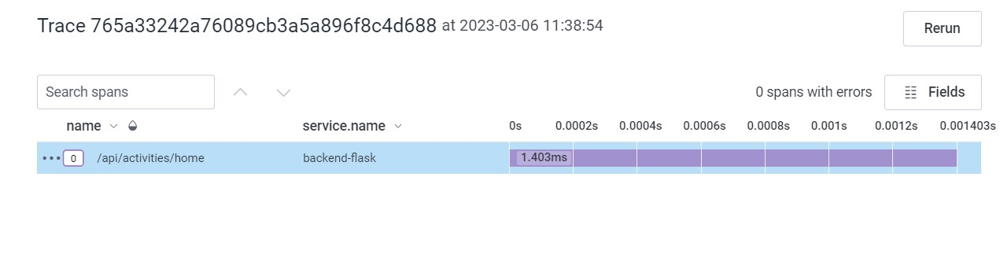
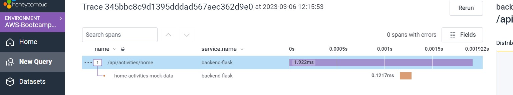
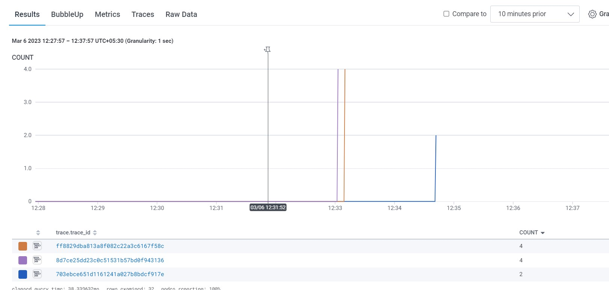
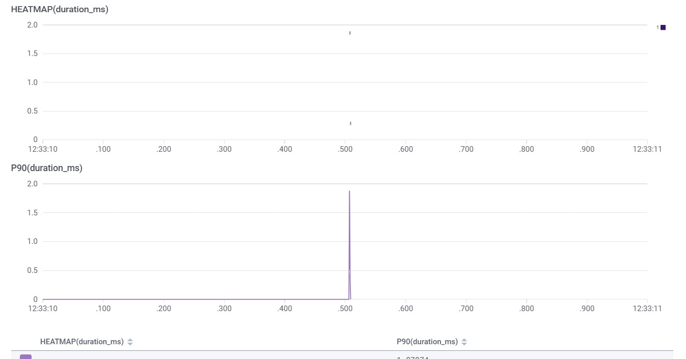
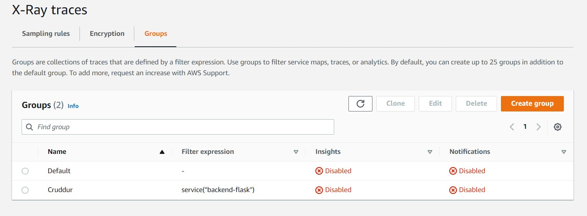
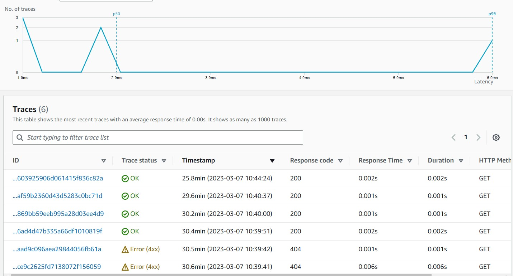
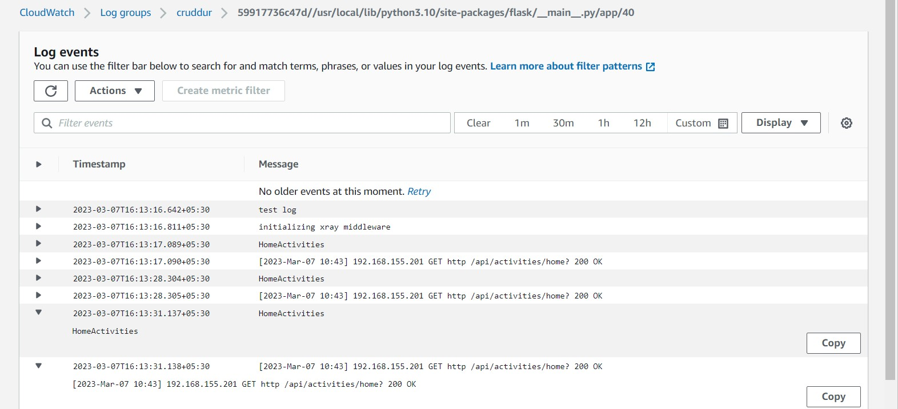
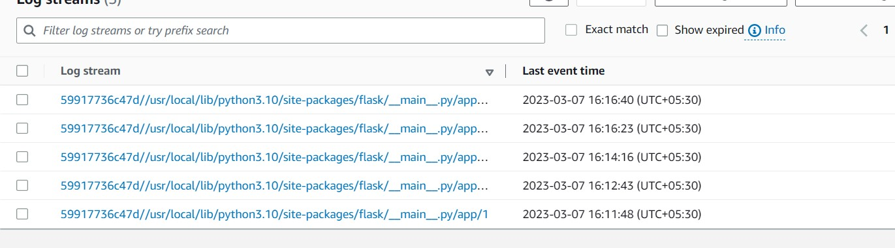

# Week 2 — Distributed Tracing

### HoneyComb Set Up

- Create an Environment of `AWS-Bootcamp-2023` in honeycomb and copy your API KEY
- Open Gitpod and set Environment variable

```
export HONEYCOMB_API_KEY="YOUR_API_KEY"
gp env HONEYCOMB_API_KEY="YOUR_API_KEY"
```

- Make sure not to give any spaces above as they will also considered as part of variable
- Open docker_compose.yml file in backend and add OTEL things under environment variables section

```
OTEL_SERVICE_NAME: "backend-flask"
OTEL_EXPORTER_OTLP_ENDPOINT: "https://api.honeycomb.io"
OTEL_EXPORTER_OTLP_HEADERS: "x-honeycomb-team=${HONEYCOMB_API_KEY}"
```

- Once we completed setting up Environmental Variables, we now move to requirements file in Backend folder and paste opentelemtry installations

```
opentelemetry-api 
opentelemetry-sdk 
opentelemetry-exporter-otlp-proto-http 
opentelemetry-instrumentation-flask 
opentelemetry-instrumentation-requests
```

-Install requiremts through CLI by running `pip install -r requirements.txt`
- Now as part of Initialization, Open App.py and add below contents

To the `app.py`

```
from opentelemetry import trace
from opentelemetry.instrumentation.flask import FlaskInstrumentor
from opentelemetry.instrumentation.requests import RequestsInstrumentor
from opentelemetry.exporter.otlp.proto.http.trace_exporter import OTLPSpanExporter
from opentelemetry.sdk.trace import TracerProvider
from opentelemetry.sdk.trace.export import BatchSpanProcessor
```

```
# Initialize tracing and an exporter that can send data to Honeycomb
provider = TracerProvider()
processor = BatchSpanProcessor(OTLPSpanExporter())
provider.add_span_processor(processor)
trace.set_tracer_provider(provider)
tracer = trace.get_tracer(__name__)
```

```
# Initialize automatic instrumentation with Flask
app = Flask(__name__)
FlaskInstrumentor().instrument_app(app)
RequestsInstrumentor().instrument()
```

- Once you added above things, Push the changes into Github
- Check whether the the HONEYCOMB_API_KEY is set. If not make sure it to set it, else our docker won't be sending data to Honeycomb.
- Not sure why my docker is not sending any data into honey comb though everything is in place.I have commented out the Dynamo DB and Postgress code in Docker Compose file and it somehow sent data to HoneyComb.

[Honeycomb_Config_Commit](https://github.com/NiteeshKumar31/aws-bootcamp-cruddur-2023/commit/03e599c75433f0597c7c4a8c0369306d2be5339f)

#### Proof



###### Creating A Tracer for Home Activities

Open home_activities.py and add belwo code from [opentelemetry_python](https://docs.honeycomb.io/getting-data-in/opentelemetry/python/) and follow steps from creating spans

```
from opentelemetry import trace

tracer = trace.get_tracer("home.activities")

````

- Add the below code inside run function and check on the indentations

```
with tracer.start_as_current_span("home-activities-mock-data"):
```


- Add below code inside with tracer statement

```
span = trace.get_current_span()
span.set_attribute("user.id", user.id())
```

[Tracer_Commit](https://github.com/NiteeshKumar31/aws-bootcamp-cruddur-2023/commit/3e09ad4d439165188dc42d29e84b3c55116ce910)

#### Proofs:






#### Installing X-ray python SDK

- Beofre doing x-ray things, Add your AWS region repository variable

```
export AWS_REGION="ap-south-1"
gp env AWS_REGION="ap-south-1"
```

- Open requirements file in the backend and add `aws-xray-sdk`
- Execute requirements file using `pip install -r requirements.txt`

Add belwo code to `app.py`

```
from aws_xray_sdk.core import xray_recorder
from aws_xray_sdk.ext.flask.middleware import XRayMiddleware

xray_url = os.getenv("AWS_XRAY_URL")
xray_recorder.configure(service='backend-flask', dynamic_naming=xray_url)
```

- Make sure to add below line of code right after `app = Flask(__name__)`

```
XRayMiddleware(app, xray_recorder)
```

- Open aws/json folder and create a `x-ray.json` file and add

```
{
  "SamplingRule": {
      "RuleName": "Cruddur",
      "ResourceARN": "*",
      "Priority": 9000,
      "FixedRate": 0.1,
      "ReservoirSize": 5,
      "ServiceName": "backend-flask",
      "ServiceType": "*",
      "Host": "*",
      "HTTPMethod": "*",
      "URLPath": "*",
      "Version": 1
  }
}
```

### Creating an X-ray Group

- In the terminal run below command. If you get some json, probably it will means it's working.

```
aws xray create-group \
   --group-name "Cruddur" \
   --filter-expression "service(\"backend-flask\")"
```

- For Creating a Sampling rule run `aws xray create-sampling-rule --cli-input-json file://aws/json/xray.json` in terminal

[Installing and Creating group in X-Ray](https://github.com/NiteeshKumar31/aws-bootcamp-cruddur-2023/commit/81a313b4a500ea25f3c370b9450ad7419a235dfd)



### Add xray-deamon Service to Docker Compose

```
  xray-daemon:
    image: "amazon/aws-xray-daemon"
    environment:
      AWS_ACCESS_KEY_ID: "${AWS_ACCESS_KEY_ID}"
      AWS_SECRET_ACCESS_KEY: "${AWS_SECRET_ACCESS_KEY}"
      AWS_REGION: "ap-south-1"
    command:
      - "xray -o -b xray-daemon:2000"
    ports:
      - 2000:2000/udp
```

- We need to add these two env vars to our backend-flask in our docker-compose.yml file

```
      AWS_XRAY_URL: "*4567-${GITPOD_WORKSPACE_ID}.${GITPOD_WORKSPACE_CLUSTER_HOST}*"
      AWS_XRAY_DAEMON_ADDRESS: "xray-daemon:2000"
```

- Push the changes to your repo and run docker compose up
[Add xray-deamon Service to Docker Compose](https://github.com/NiteeshKumar31/aws-bootcamp-cruddur-2023/commit/3f195b1bcaa52eac499b19fffefddfeaf39a0ed1)



### CloudWatch Logs

- Open Requirements in backend and add `watchtower`
- Execute requirements file using `pip install -r requirements.txt`

In `app.py` add

```
import watchtower
import logging
from time import strftime
```

```
# Configuring Logger to Use CloudWatch
LOGGER = logging.getLogger(__name__)
LOGGER.setLevel(logging.DEBUG)
console_handler = logging.StreamHandler()
cw_handler = watchtower.CloudWatchLogHandler(log_group='cruddur')
LOGGER.addHandler(console_handler)
LOGGER.addHandler(cw_handler)
LOGGER.info("test log")

```

```
@app.after_request
def after_request(response):
    timestamp = strftime('[%Y-%b-%d %H:%M]')
    LOGGER.error('%s %s %s %s %s %s', timestamp, request.remote_addr, request.method, request.scheme, request.full_path, response.status)
    return response
```

- Under home_activities.py add `logger.info("HomeActivities")` right after run() function and update run() to `run(logger)`
- Inside `app.py` go to home/activities route function and update data variable to `data = HomeActivities.run(logger=LOGGER)`
- Inside docker_compose file add belwo environment variables.

```
AWS_DEFAULT_REGION: "${AWS_DEFAULT_REGION}"
AWS_ACCESS_KEY_ID: "${AWS_ACCESS_KEY_ID}"
AWS_SECRET_ACCESS_KEY: "${AWS_SECRET_ACCESS_KEY}"
```

[Cloud watch logs set up](https://github.com/NiteeshKumar31/aws-bootcamp-cruddur-2023/commit/9949f535f8b6d53aade91918474c5ddd545ac9d7)




- Comment out all the things of cloud watch logs and x-ray to get ride of the spend

[Commenting CloudWatch&X-ray things to avoid spend](https://github.com/NiteeshKumar31/aws-bootcamp-cruddur-2023/commit/00c2626392b525fb08797d82397b0ece904b1b93)
